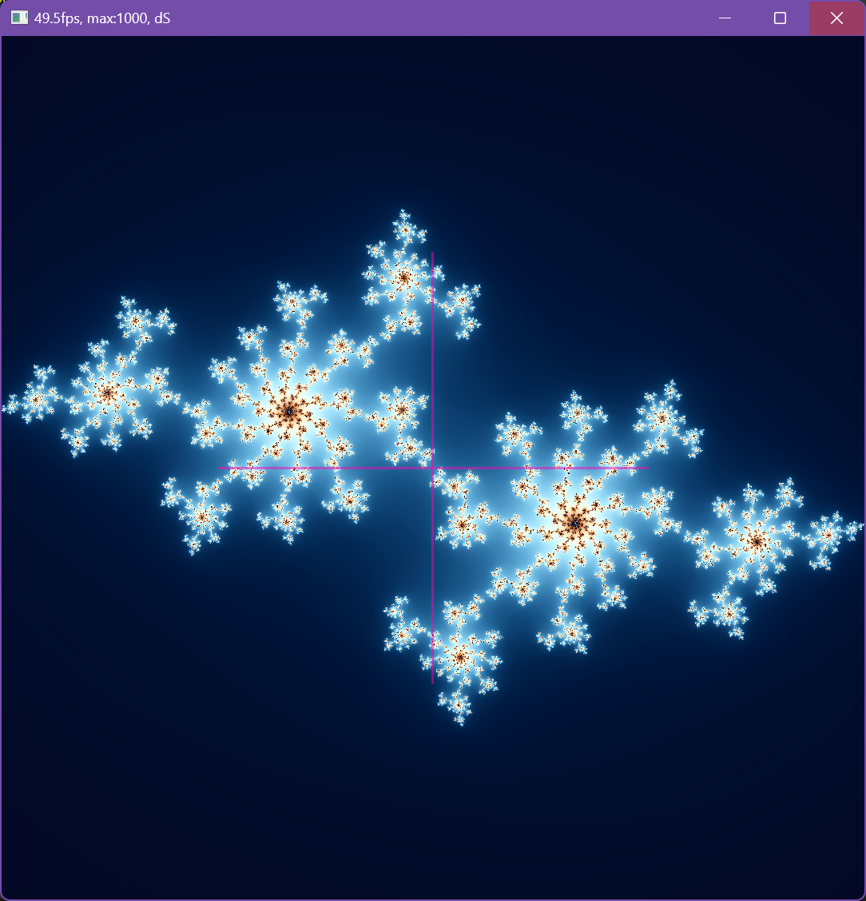

# Garage Days in Mandelbrot

Now, as I reminisce, a familiar eagerness stirring within me. A longing to dive back into the demoscene. It beckons, like the songs of mermaid to a lost sailor, promising new wizardries and endless opportunities for expression and innovation.

Demoscene, you ask? Check out it's wiki-page [here](https://en.wikipedia.org/wiki/Demoscene). 

|||
|:--:|:--:| 
|*Demoscene... if you know, you know.*|*Mandelbrot Voxel from Future Crew's 1992 demo, 'Panic'.*|
 
 Some Mandelbrot generated on the archaic CGA graphic card:

|||
|:--:|:--:|
|*from Vintage Computer Federation Forums*|*from wikipedia.*|

Yeah, that is the realtime animated voxel Mandelbrot running on a 80386 back then in 1992. I still remember my GW-BASIC rendering of a 320x200 Mandelbrot took more than a day on the 4.77MHz 8088 computer.

2024 is spoiling us with the blazing CPUs and GPUs. It's indeed a good time to find my way back into the demoscene. Mandelbrot is an excellent warm-up exercise to pick up those new trades and tricks, don't you think?

## Who, What, Why, is the Mandelbrot?

A picture (or video these days) is worth a thousands words. Let's just watch this first:

|[](https://www.youtube.com/watch?v=LhOSM6uCWxk&ab_channel=MathsTown)|
|:--:|
|*The Hardest Trip - Mandelbrot Fractal Zoom by Maths Town*|

In this captivating video, witness an hour-long zoom into a 2d map created by a deceptively simple equation:
```math
z_{n+1} = z_{n}^2 + c
```
Here's the breakdown:
- $z_n$ represents a complex number at $n$-th iteration.
- $c$ is a constant complex number (think of it as a 2d vector), often the coordinates being tested.

Yes, but how you get the picture seen in the video? Well, Well, the color of each point in the picture tells its own tale— the number of iterations it undergoes before spiraling into infinity. If it manages to evade this fate, it earns a place in the 'black' hole.

So how do we know if the point will spiral into infinity? We just have to check that $\mid z_{n}\mid$ has became very large, then we bail out from the calculation loop. If at the end of the preset maximum iterations, $\mid z_{n}\mid$ is still not large, we will assume it is in the 'black' hole.

|| 
|:--:| 
|*<p style="width: 360px">Iterating on 3 different (red, green, blue) points on the complex plane. Notice how the green point takes off when it falls outside the circle (radius = 2). Image from [blog post by stc](https://blogs.kent.ac.uk/onetwomany/2020/04/24/deterministic-vs-predictable-the-mandelbrot-set/)</p>*| 


But what is the threshold for $\mid z_{n}\mid$ being large? Well, it's been mathematically confirmed that, if at any moment, $\mid z_{n}\mid >2$, then $\mid z_{n+1}\mid > \mid z_{n}\mid $. That is, once the point's distance from the origin is greater than 2, then this distance is always going to increase in every subsequent iteration- it's going infinity and beyond. So, we simply have to check:

```math
\mid z_{n}\mid >2
```
Really, that is all. Seems like a ruse, no? A surprisingly simple equation giving us such complexity. That's the captivating beauty of fractals, and Mandelbrot is just one intriguing example.

## We Need a Map, A Mandelbrot Map

To begin our journey to explore, we need a map! So we are going to code a Mandelbrot Exploring program. Simple, but not always easy. So what we want our little program to do is:
- Realtime interaction, that is optimized Mandelbrot rendering that allows forreal-time response to user events. 
- User events includes zoom in and out on the Mandelbrot map.
- User events includes transversing across the Mandelbrot map.

Like all interesting projects,  there should be implementation challenges.

## Free Lunch? Performance and User Experience
In an ideal world, we'd have it all – stunning rendering, unlimited pixels, endless computational power, pinpoint precision, superb user interactivity and experience. But we do not have all these technologies yet, and I do not have RTX 4070. Bringing ourselves back to earth, compromises and trade-offs are inevitable when designing our program.

So we shall parameterized our program where we can, offering the user to change the level of performance where possible. Like choosing:
- Rendering resolution , or the window size.
- Choice of rendering precision, see the next section.
- Choice of maximum iterations.

To enhance realtime interaction experience, we implement the following *tricks*:

## Scaling the Map, Scaling the Problems

Navigating the Mandelbrot set at very high scale presents another unique challenge. As the scale increases, 3 major issues arise:

### Data Precision and Rendering Limitations

Look at the picture below, observe the visual artifacts.

|||
|:--:|:--:| 
|*<p style="width: 360 px">'Chromosome' artifacts (hint: idiograms) at scale $1e13$, 2x32 bit precision, somewhere near $(-1.5+ 0i)$.</p>*|*<p style="width: 360 px">'Mosaic' artifacts at scale $1e13$, 2x32 bit precision, somewhere near $(0.5+ 0.5i)$.</p>*|

At high zoom scales, visual artifacts appears on the Mandelbrot due to limitations in arithmetic precision, 2x32 bit in our example. As we zoom deeper into the fractal, the numbers involved become incredibly small, and the differences between neighboring points become increasingly subtle. 

Suppose we're zooming into a region of the Mandelbrot set where the coordinates are very small, let's say around some point at $z=(-1.5+0.1i)$, and we're calculating the iterations of the Mandelbrot function using 32-bit floats. 

At a certain zoom level, the difference between neighboring points might be on the order of $1e-8$ or smaller. However, with 32-bit floats, we only have precision up to 6 digits. This means that the precision of our calculations is insufficient to accurately distinguish between points at such a small scale. (Indeed, if we use 32bit precision instead of 2x32 bit, the artifacts will be visible around zoom scale $1e7$.)

So to the rendering algorithm, it is as if we are asking it to calculate the same point repeatedly, thus the 'Mosaic' artifacts.

There is more to learn from these artifacts. You might already be wondering why 'Chromosome' artifacts near $z=(-1.5 +0i)$? This is indeed as expected. What you are witnessing is the varying precision of the floating point representation. The precision of a number varies depending on its distance from zero. Numbers closer to zero have higher precision, meaning they can represent smaller differences between adjacent values. As the magnitude of a number increases, its precision decreases, and it can only represent larger intervals between adjacent values.

So, near $z=(-1.5 +0i)$, we can expect our floating point to have better precision in the $y$ ( imaginary) axis than the $x$ (real) axis. Hence, flattening the moasics into chromosome map.

Now, if we fix those artifacts using 2x64 bit calculation, we get beautiful maps again.

|||
|:--:|:--:|
|*<p style="width: 360px">At scale $1e13$, 2x64 bit precision, somewhere near $(-1.5+ 0i)$.</p>*|*<p style="width: 360px">At scale $1e13$, 2x64 bit precision, somewhere near $(0.5+ 0.5i)$.</p>*|

### Transversing Limitations.
Similarly, at high zoom scale, we will be transversing the map in very small steps, e.g. $1e-15$.
Suppose we want to tranverse horizontally with a tiny step $\delta_{step}$, so we get the new horizontal position as follows:

```math
x_{1} = x_{0}+ \delta_{step}
```

But, we will find that, the new position remains the same, because the difference falls outside what the floating representation can take, dropping them and only retaining the sigificant decimals.
```math
x_{1} = x_{0}
```

Hence, our user will be crippled at high zoom scale, where he can only zoom-in and -out, but not transversing the map.

This again, can be solved by using high precision calculation, at the cost of rendering speed.


### Costly Iterations.

At lower zoom levels, where the view encompasses a wider area of the Mandelbrot, fewer iterations are needed to determine the color of each pixel because the details are less pronounced. However, as we zoom in, the intricate structures of the Mandelbrot become more apparent, requiring more iterations to accurately capture the complexity of the set. As you can see in the video *The Hardest Trip* (see above), the max iterations at at 539 million. 

For realtime interactivity, good quality rendering (more iterations!) at high zoom scale is  going to be very challenging.
|||
|:--:|:--:| 
|<p style="width: 360 px">With max iterations at 100, so many details are lost, as many points are still considered to be in orbit, $\mid z\mid< 2$, after 100 iterations.</p> | <p style="width: 360 px">With max iterations at 1000, the details are back.</p>|


## Some Tricks

To improve realtime interaction, that is reducing the response time to user input events (panning, zooming), the Mandelbrot will be rendered at a lower resolution when view change is in progress. When the view becomes stationary, the Mandelbrot will be rendered in full resolution.

In our code, we preset the desired downsampling factor (relative to window size) during non-stationary rendering. 
```cpp
/* During movement (zoom, translate), for speedy interaction,
   rendering will be performed  at lower resolution of 
   (screen_width x screen_height) / SUB_RENDER_FACTOR.
 */
constexpr int SUB_RENDER_FACTOR = 4;
```

For the Mandelbrot to render to a lower resolution during transition, 
we will need to create a frame buffer object, or FBO:
```cpp
    ...
    GLuint g_mbd_texture; // texture ID for manderbrot rendering

    create_subres_texture( 
        win_width, win_height, SUB_RENDER_FACTOR, g_mbd_texture);

    // Set up mandelbrotFBO
    unsigned int _mandelbrot_FBO;

    glGenFramebuffers( 1, &_mandelbrotFBO);
    glBindFramebuffer( GL_FRAMEBUFFER, _mandelbrotFBO);
    glFramebufferTexture2D( 
        GL_FRAMEBUFFER, 
        GL_COLOR_ATTACHMENT0,
        GL_TEXTURE_2D, 
        g_mdb_texture, 0);
    ...
```

The sub-resolution texture for rendering is created from:
```cpp
/**
 * @brief Creates a texture with reduced resolution for sub-rendering purposes.
 *
 * @param[in] wd_  Width of window
 * @param[in] ht_  Height of window
 * @param[in] factor_ The factor by which to reduce the resolution of the texture.
 * @param[out] rout_texture_ Reference to store the generated texture ID.
 */
void create_subres_texture( 
    const int wd_, const int ht_, const int factor_, GLuint &rout_texture_)
{
    // Generate texture
    glGenTextures(1, &rout_texture_);

    // Bind texture
    glBindTexture(GL_TEXTURE_2D, rout_texture_);

    // Allocate texture memory
    glTexImage2D(
        GL_TEXTURE_2D, 0, GL_RGBA,
        wd_/ factor_, ht_/ factor_,
        0, GL_RGBA, GL_UNSIGNED_BYTE, 0);

    // Set texture parameters, texture magnification filter
    glTexParameteri(GL_TEXTURE_2D, GL_TEXTURE_MAG_FILTER, GL_NEAREST); 

    // Unbind texture
    glBindTexture(GL_TEXTURE_2D, 0);
    return;
}
```

In the main render loop, whenever there is a view or camera update, the Mandelbrot shader to write to the FBO, then the Upscaling shader will read from the FBO and interpolate onto the default render buffer for display.
```cpp
    if (b_update_cam || b_update_zoom) {
        // There is camera motion, view is being changed,
        // so we need to recalculate the Mandelbrot
         ...

        // Bind the framebuffer object (FBO) to render to
        glBindFramebuffer(GL_FRAMEBUFFER, mandelbrotFBO);

        // Set the viewport to the size of the FBO
        glViewport(0, 0, scrn_wd / SUB_RENDER_FACTOR, scrn_ht / SUB_RENDER_FACTOR);

        // render the mandelbrot onto the FBO
        ...

        // Unbind the framebuffer to render to the default framebuffer
        glBindFramebuffer(GL_FRAMEBUFFER, 0);
        // Change the viewport to the window size
        glViewport(0, 0, scrn_wd, scrn_ht);

        // use the upscaling shader to interpolate the FBO to window size
        gp_upscale_shader->use_shader();
        // Bind Mandelbrot texture to read from
        glBindTexture(GL_TEXTURE_2D, g_mdb_texture); 
        ...
    }
```

There is one more thing to do. As we allow the user to resize the application window,
the FBO and texture have to be resized accordingly when there is a window resize event. To do this, we will need to attach a callback function:

```cpp
glfwSetWindowSizeCallback(window, win_resize_callback);
```

```cpp
/**
 * @brief Callback function for handling win size change events.
 */
void win_resize_callback(GLFWwindow* window_, int wd_, int ht_)
{  
    // Set viewport
    glViewport(0, 0, wd_, ht_);

    // Resize the Mandelbrot texture object
    glBindTexture(GL_TEXTURE_2D, g_mdb_texture);
    glTexImage2D(
        GL_TEXTURE_2D, 0, GL_RGBA,
        wd_ / SUB_RENDER_FACTOR,
        ht_ / SUB_RENDER_FACTOR,
        0, GL_RGBA, GL_UNSIGNED_BYTE, 0);
    glBindTexture(GL_TEXTURE_2D, 0);

    return;
}
```

That completes our rendering trick during user-triggered events.


## Languages and Libraries Used

In this project is written in C/C++, together with GLSL, in Visual Studio 2022. The libraries used are a follows:

- **[OpenGL](https://www.opengl.org/)**: The industry-standard graphics API, providing a robust framework for rendering visuals.
- **[GLFW](https://www.glfw.org/)**: A simple, cross-platform library for creating windows, contexts, and managing input. It's been instrumental in providing a smooth and responsive user experience.
- **[GLM](https://glm.g-truc.net/)**: A mathematics library for graphics programming, offering a wide range of functions and utilities for vector and matrix manipulation.
- **[Glad](https://github.com/Dav1dde/glad)**: A loader-generator for OpenGL, providing modern OpenGL functions and extensions. Generated online based on the profile and extensions required. Yes, you need this and you will be glad. It makes OpenGL setup easier.

## Usage
Use the following keys to explore the Mandelbrot Map:
- **W**: Move the view upwards
- **S**: Move the view downwards
- **A**: Move the view to the left
- **D**: Move the view to the right
- **Q**: Zoom in
- **E**: Zoom out
- **R**: Reset view
- **M**: Toggle precision between '*dS*' (2x32 bit) and '*dD*' (2x64 bit)
- **0**: Set max iteration to 100
- **1**: Set max iteration to 1000
- **2**: Set max iteration to 2000
- **3**: Set max iteration to 4000
- **4**: Set max iteration to 8000
- **5**: Set max iteration to 12000
- **Esc**: Quit


Status of the framerate, max iteration, and precision mode is displayed in the windows title bar.

## Some Screenshots

|||
|:--:|:--:| 
|<p style="width: 360 px">Mandelbrot, bird's eye view. The red crosshair shows where you will be diving into. Rendering at 2x32bit precision, 1000 iterations. Notice the rendering is programmatically capped at about 60fps.</p> | <p style="width: 360 px">Zooming to one of the islands on $Re(z)<-1$. With double-float (2x32 bit) arithmetic, we begain to see precision errors at scale 1e12.</p>|


|||
|:--:|:--:|
|<p style="width: 360 px">Switching to double-double (2x64 bit), we can nice rendering again</p>|<p style="width: 360 px">At scale $1e22$, the artifacts return. We have to use arbitrary precision maths to go beyond here.</p>|

## Closing Thoughts

Revisiting the Mandelbrot really stirs up decades-old 8bit-fuzzy memories, granting myself a chance to look at it with fresh (and hopefully, more seasoned) perspective. 

But there is certainly more can be done, which i will be keen to work on them soon:
- **Perturbation Theory**, can help optimize Mandelbrot rendering by estimating the behavior of nearby points in the complex plane, reducing the computational load and speeding up calculations.
  
- **Arbitrary-Precision Math**, also called bignum arithmetic, used in computing large number (or in the  Mandelbrot, very small numbers). Only limited by host system memory. However, this technique is often used only where precision have priority over speed. Clearly, going against our user interactivity requirment. We'll see. Exising libraries supporting this, the GNU MPFR library and the GMP arithmetic library.

So, that's that. Until next time, drink, debug, and laugh!

*wslee/ garfield, 2024*

## Bonus

One more thing, you can turn this into Julia set explorer with just one (or two?) line change in the shader codes. You like to try? 

|||
|:--:|:--:|
|*<p style="width: 360px">A Julia set at z=(0.28 + 0.008i)</p>*|*<p style="width: 360px">Another Julia set at z=(-0.70176 + 0.3842i)</p>*|

Read more about Julia set on [wiki](https://en.wikipedia.org/wiki/Julia_set) or this [excellent article by Karl Sims](https://www.karlsims.com/julia.html).

## References
- *Introduction to regular perturbation theory*, van den Eijnden, Eric.
- *Perturbation techniques applied to the Mandelbrot set*, Claude Heiland-Allen.
- *Floating-point Computation*, Pat Sterbenz, Prentice-Hall, 1974s.
- *Adaptive Precision Floating-Point Arithmetic and Fast Robust Geometric Predicates*, JR Shewchuk, 1997.
- *Arbitrary precision real arithmetic: design and algorithms*, Valérie Ménissier-Morain, 2020.
